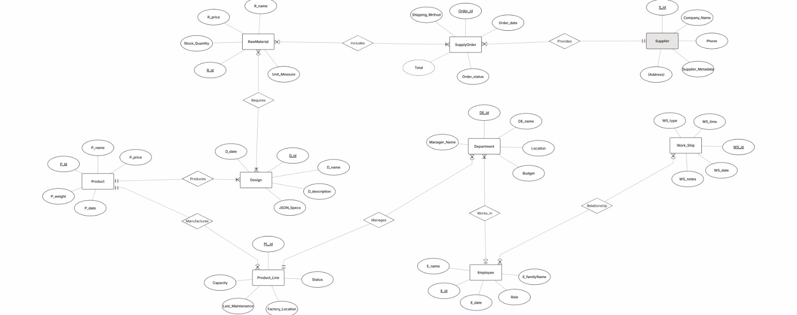

# targil0
# מיני פרויקט בבסיסי נתונים - אגף עיצוב וייצור
**מגישות:** שרי אדלר, מיכל גרינבלט וחני כהן  
**קורס:** מיני פרויקט בבסיסי נתונים  
**נושא האגף:** עיצוב וייצור (דגמים, חומרי גלם, מוצרים, ספקים ועובדים)
---

### 1. מבוא ותיאור המערכת
פרויקט זה מתמקד ב**אגף עיצוב וייצור** כחלק ממערכת כוללת לניהול רשת חנויות. 
האגף אחראי על ניהול מחזור החיים של המוצר מרמת הרעיון והעיצוב ועד לייצורו בפועל, תוך תיאום עם ספקים לניהול חומרי הגלם ושיבוץ עובדים למשמרות הייצור.

**תחומי אחריות באגף:**
* **אגף מחקר ופיתוח (R&D):** ניהול דגמים (Designs) ומפרטי JSON טכניים.
* **לוגיסטיקה ורכש פנים-אגפי:** מעקב אחר חומרי גלם (Raw Materials) והזמנות רכש מול ספקים.
* **ייצור:** ניהול קווי ייצור (Production Lines) והפיכת דגמים למוצרים (Products) סופיים המוכנים למכירה בחנות.
* **ניהול כוח אדם:** שיוך עובדים (Employees) למחלקות ושיבוצם במשמרות (Work Shifts)..

---

## 2. תכנון לוגי - דיאגרמת ERD
המערכת מורכבת מ-**9 ישויות מרכזיות**. לכל ישות הוגדרו לפחות 5 תכונות (Attributes) כדי להבטיח פירוט נתונים מרבי ודיוק בתהליכי העבודה.

### דיאגרמת ERD:
  

